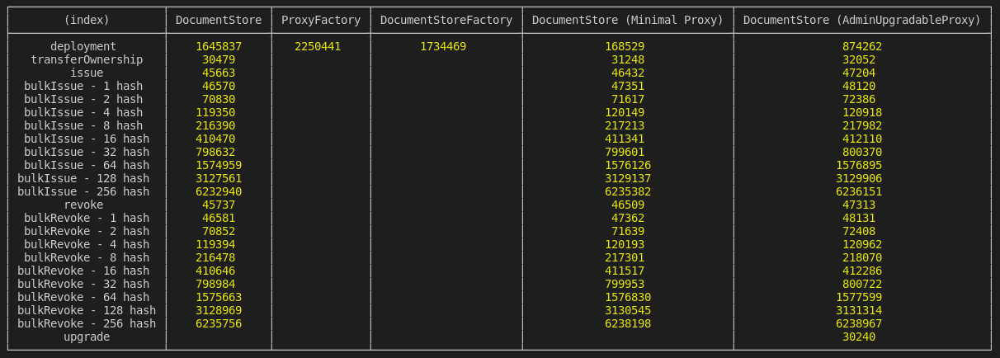

# Document Store

This repository contains both the smart contract code for document store (in `/contracts`) as well as the node package for using this library (in `/src`).

## Installing Package

```sh
npm i @govtechsg/document-store
```

## Package Usage

To use the package, you will need to provide your own Web3 [provider](https://docs.ethers.io/ethers.js/html/api-providers.html) or [signer](https://docs.ethers.io/ethers.js/html/api-wallet.html) (if you are writing to the blockchain).

Deploying new document store

```ts
import {deploy} from "@govtechsg/document-store";

const documentStore = await deployAndWait("My Document Store", signer).then(console.log);
```

Connecting to existing document store on Ethereum

```ts
import {connect} from "@govtechsg/document-store";

const documentStore = await connect("0x4077534e82c97be03a07fb10f5c853d2bc7161fb", providerOrSigner);
```

Deploying new document store with minimal proxy (TBD - Not available yet)

```ts
import {deployMinimal} from "@govtechsg/document-store";

deployMinimal("My Document Store", signer).then(console.log);
```

Interacting with the document store (example)

```ts
const issueMerkleRoot = async () => {
  const documentStore = connect("0x4077534e82c97be03a07fb10f5c853d2bc7161fb", signer);

  const tx = await documentStore.issue("0x7fe0b58ed760804eb7118988637693c4351613be327b56527e55bcd0a8d170d7");
  const receipt = await tx.wait();
  console.log(receipt);

  const isIssued = await instance.isIssued("0x7fe0b58ed760804eb7118988637693c4351613be327b56527e55bcd0a8d170d7");
  console.log(isIssued);
};
```

List of available functions on contract

```text
documentIssued
documentRevoked
isOwner
name
owner
renounceOwnership
transferOwnership
version
initialize
issue
bulkIssue
getIssuedBlock
isIssued
isIssuedBefore
revoke
bulkRevoke
isRevoked
isRevokedBefore
```

## Provider & Signer

Different ways to get provider or signer:

```ts
import {Wallet, providers, getDefaultProvider} from "ethers";

// Providers
const mainnetProvider = getDefaultProvider();
const ropstenProvider = getDefaultProvider("ropsten");
const metamaskProvider = new providers.Web3Provider(web3.currentProvider); // Will change network automatically

// Signer
const signerFromPrivateKey = new Wallet("YOUR-PRIVATE-KEY-HERE", provider);
const signerFromEncryptedJson = Wallet.fromEncryptedJson(json, password);
signerFromEncryptedJson.connect(provider);
const signerFromMnemonic = Wallet.fromMnemonic("MNEMONIC-HERE");
signerFromMnemonic.connect(provider);

```

## Setup

```sh
npm install
npm lint
npm test
npm truffle <command>
```

## Contract Benchmark

A benchmark is provided to show the different transaction cost of the different variants of the document store.

```sh
npm run benchmark
```



## Notes

If you are using vscode, you may need to link the openzeppelin libraries. See https://github.com/juanfranblanco/vscode-solidity#openzeppelin
